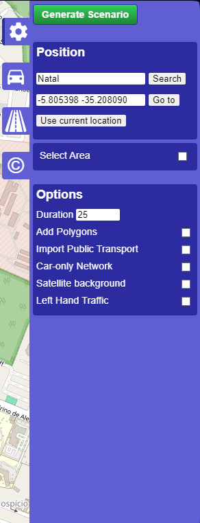

# Introduction

This is a simple project to perform a tperformance analysis using the [Simulation of Urban MObility (SUMO)](https://sumo.dlr.de/docs/index.html).


# Setup

## Install SUMO

Download the latest version of SUMO from [here](https://sumo.dlr.de/docs/Installing/index.html). The version used in this project is 1.18.0.

## Install Requirements

```bash
pip install -r requiremnets.txt
```

# Usage

## Generate a network

To generate a scenario, in Windows, find the `osnWebWizard.py` file and execute using python.Generally, the path is `C:\Program Files (x86)\Eclipse\Sumo\tools\osmWebWizard.py`. The command is as follows:

```bash
python3 "C:\\Program Files (x86)\\Eclipse\\Sumo\\tools\\osmWebWizard.py"
```

## Configure the network

To reproduce the settings used in this project, configure the network as follows:




And finally, select the area of interest:


Click on `Generate Scenario` and wait for the network to be generated.

## Run the simulation

To run the simulation, use the following command:

```bash
python main.py
```

## Analysis

You can open the `performance_analysis.ipynb` file to see the results of the simulation. You can alson run the file using Jupyter Notebook.